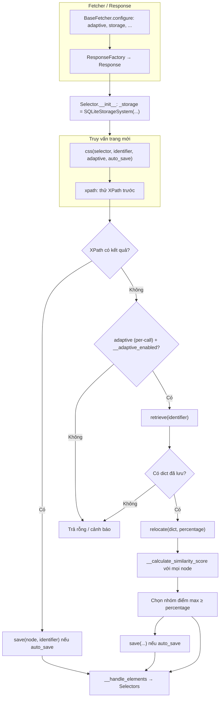
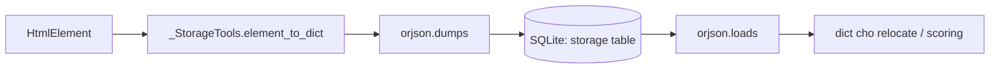
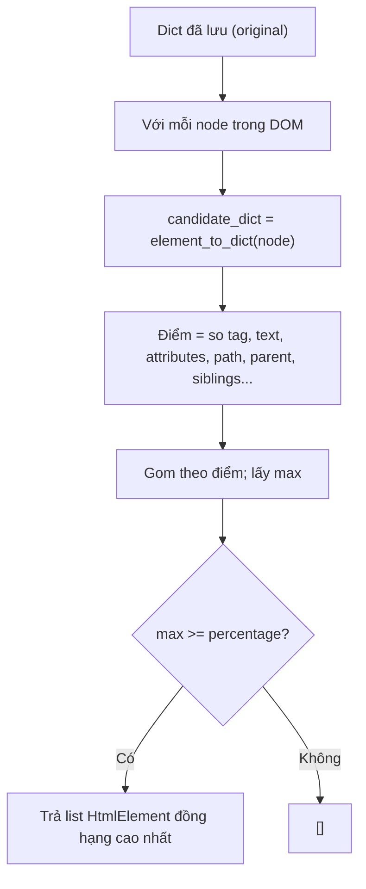

# Tính năng Adaptive — cấu trúc thay đổi & “snapshot” lưu trữ

Tài liệu mô tả **cách Scrapling xử lý khi website đổi HTML/CSS** nhưng vẫn cố **tìm lại phần tử tương đương**, và **dữ liệu nào được lưu** (không phải ảnh chụp màn hình, mà là **đặc trưng có cấu trúc** của phần tử trong DB).

---

## 1. Ý tưởng tổng quan

1. **Lần đầu (hoặc khi bật `auto_save`):** thư viện lưu một **“chữ ký”** của phần tử khớp selector — dạng **dictionary** (tag, text, attributes, path tag cha/con, anh em, …).
2. **Lần sau:** vẫn chạy **CSS/XPath** như cũ. Nếu **không còn khớp** (`xpath` trả rỗng) *và* bật **`adaptive=True`** trên lệnh (và adaptive bật trên `Selector`/`Response`), Scrapling **đọc lại** chữ ký đã lưu theo **`identifier`**, rồi **quét toàn bộ cây DOM**, chấm **điểm tương đồng** với từng node và chọn nhóm điểm cao nhất — đó chính là **relocate**.

**Không có “magic” học máy:** đây là **so khớp heuristic** dựa trên `difflib.SequenceMatcher` và so sánh từ điển thuộc tính.

---

## 2. “Snapshot” lưu gì? Lưu ở đâu?

### 2.1. Không lưu full HTML page

- Lưu **một bản ghi cho mỗi cặp (domain/url key, `identifier`)** trong hệ thống storage (mặc định **SQLite**).
- Nội dung cột là **JSON** (serialize bằng **orjson**) của dict từ **`_StorageTools.element_to_dict()`** — tức là metadata phần tử, **không** phải file ảnh hay copy nguyên subtree HTML.

### 2.2. Các trường trong dict “chữ ký” (tóm tắt)

Nguồn: `scrapling/core/utils/_utils.py` — class **`_StorageTools`**, method **`element_to_dict`** (và **`_get_element_path`**).

| Thành phần | Ý nghĩa |
|------------|---------|
| `tag` | Tên thẻ (string). |
| `attributes` | Thuộc tính đã làm sạch (bỏ rỗng / forbidden). |
| `text` | Text trực tiếp của node (strip). |
| `path` | **Tuple** các tên tag từ gốc xuống node (đường đi trong cây). |
| `parent_name`, `parent_attribs`, `parent_text` | Thông tin node cha (nếu có). |
| `siblings` | Tuple tag của các anh em (cùng cha). |
| `children` | Tuple tag của con trực tiếp (bỏ node cấm). |

### 2.3. Lưu trong SQLite (mặc định)

Nguồn: `scrapling/core/storage.py` — **`SQLiteStorageSystem`**.

- Bảng **`storage`**: cột `url` (chuẩn hóa theo base domain qua `StorageSystemMixin._get_base_url`), `identifier`, `element_data` (bytes JSON).
- **`INSERT OR REPLACE`** khi ghi; **`SELECT ... WHERE url = ? AND identifier = ?`** khi đọc (tránh SQL injection bằng tham số hóa).

### 2.4. Mở rộng

- Có thể thay backend bằng class kế thừa **`StorageSystemMixin`** (Redis, v.v.) — xem `docs/development/adaptive_storage_system.md`.

---

## 3. Luồng xử lý chi tiết (theo mã nguồn)

### 3.1. Bật adaptive trên `Selector` / `Response`

- **`Selector.__init__`** (`parser.py`): nếu `adaptive=True`, khởi tạo **`_storage`** — mặc định gọi factory **`SQLiteStorageSystem`** với `storage_file` (mặc định `elements_storage.db` cạnh package) và `url` để tách dữ liệu theo site.
- Fetcher trả **`Response`** (kế thừa `Selector`): **`BaseFetcher`** (`engines/toolbelt/custom.py`) có class attributes `adaptive`, `storage`, `storage_args`, `adaptive_domain`; **`_generate_parser_arguments()`** truyền vào **`Response`** → **`Selector.__init__`**.  
  `adaptive_domain` cho phép dùng “khóa URL” khác URL thật khi cần (ví dụ gom adaptive theo domain cố định).

### 3.2. `css()` → `xpath()` (nhánh adaptive)

File: **`scrapling/parser.py`**.

1. **`css()`** chuyển CSS → XPath (`_css_to_xpath`), gọi **`xpath()`** với cùng `identifier`, `adaptive`, `auto_save`, `percentage`.
2. **`xpath()`**:
   - Nếu XPath **tìm thấy** node: nếu `auto_save` và adaptive bật → **`save(elements[0], identifier)`** (lưu snapshot dict).
   - Nếu XPath **không tìm thấy** và **`__adaptive_enabled`**:
     - Nếu **`adaptive=True`** trên lệnh:  
       `element_data = retrieve(identifier)`  
       → nếu có dữ liệu: **`elements = relocate(element_data, percentage)`**  
       → nếu tìm được và `auto_save`: **`save(elements[0], identifier)`** (cập nhật snapshot theo DOM mới).
   - Trả về qua **`__handle_elements`**.

### 3.3. `relocate()` và điểm số

File: **`scrapling/parser.py`**.

- **`relocate`**: duyệt **mọi phần tử** trong cây (`_find_all_elements(self._root)`), với mỗi node gọi **`__calculate_similarity_score(dict đã lưu, node)`**, gom theo điểm; lấy **max điểm**; nếu `>= percentage` (mặc định 0 = chấp nhận mọi điểm tối đa) thì trả các node đồng hạng cao nhất.
- **`__calculate_similarity_score`**: so khớp tag, text (`SequenceMatcher`), toàn bộ `attributes` (qua **`__calculate_dict_diff`**), riêng `class`, `id`, `href`, `src`, so khớp **`path`** (tuple đường đi tag), thông tin parent, siblings, v.v. — chuẩn hóa thành **phần trăm** `round((score / checks) * 100, 2)`.

### 3.4. `save` / `retrieve` trên `Selector`

File: **`scrapling/parser.py`**.

- **`save`**: ép `Selector` → `HtmlElement`, gọi **`self._storage.save(target_element, identifier)`**.
- **`retrieve`**: **`self._storage.retrieve(identifier)`** → dict hoặc `None`.

### 3.5. Tầng storage cụ thể (SQLite)

File: **`scrapling/core/storage.py`**.

- **`save`**: `element_to_dict` → `orjson.dumps` → `INSERT OR REPLACE`.
- **`retrieve`**: `SELECT` → `orjson.loads` → dict.

---

## 4. Bảng tham chiếu file & hàm

| File | Hàm / class | Vai trò |
|------|-------------|---------|
| `scrapling/parser.py` | `Selector.__init__` | Bật adaptive, gắn `SQLiteStorageSystem` (hoặc custom). |
| `scrapling/parser.py` | `Selector.css`, `Selector.xpath` | Điều kiện lưu / fallback retrieve + relocate. |
| `scrapling/parser.py` | `Selector.relocate` | Quét cây, gọi điểm tương đồng. |
| `scrapling/parser.py` | `Selector.__calculate_similarity_score`, `__calculate_dict_diff` | Thuật toán điểm. |
| `scrapling/parser.py` | `Selector.save`, `Selector.retrieve` | Cầu nối tới storage. |
| `scrapling/core/utils/_utils.py` | `_StorageTools.element_to_dict`, `_get_element_path` | Tạo dict “snapshot” từ `HtmlElement`. |
| `scrapling/core/storage.py` | `StorageSystemMixin`, `SQLiteStorageSystem.save/retrieve` | Lưu DB (JSON trong SQLite). |
| `scrapling/engines/toolbelt/custom.py` | `Response`, `BaseFetcher`, `_generate_parser_arguments` | Fetcher truyền `adaptive`/`storage` vào `Response`/`Selector`. |
| `scrapling/engines/toolbelt/convertor.py` | `ResponseFactory.from_http_request`, v.v. | Gộp `parser_arguments` (gồm adaptive) khi tạo `Response`. |

---

## 5. Sơ đồ Mermaid

### 5.1. Luồng từ fetch đến adaptive

### 5.2. Từ phần tử DOM đến bản ghi SQLite

### 5.3. Relocate — ý tưởng thuật toán

---

## 6. Ghi chú sử dụng

- Cần **`adaptive=True`** khi khởi tạo `Selector`/`Response` (hoặc `Fetcher.configure(adaptive=True)`), **và** thường **`adaptive=True`** trên từng lệnh `css(..., adaptive=True)` khi muốn fallback sau khi selector hỏng.
- Nên đặt **`identifier`** ổn định (ví dụ `"product-title"`) thay vì dựa vào chuỗi selector dài — dễ retrieve đúng “chỗ đã lưu”.
- **`percentage`**: ngưỡng tối thiểu (0–100) cho điểm tương đồng; để mặc định 0 thì luôn chấp nhận bản khớp “tốt nhất” hiện có.

---

*Tài liệu dựa trên mã nguồn `scrapling/parser.py`, `scrapling/core/utils/_utils.py`, `scrapling/core/storage.py`, `scrapling/engines/toolbelt/custom.py`.*
