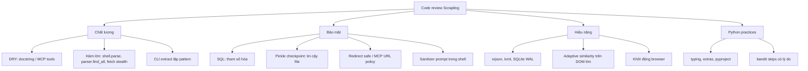
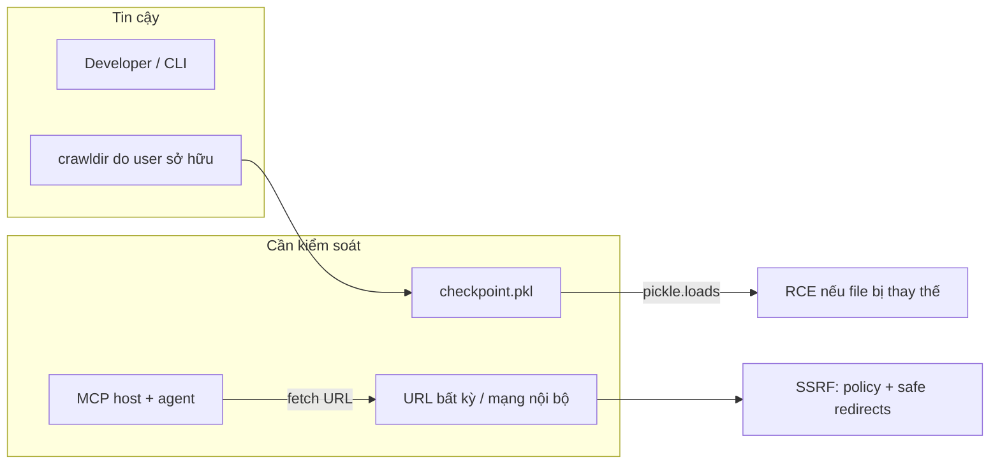
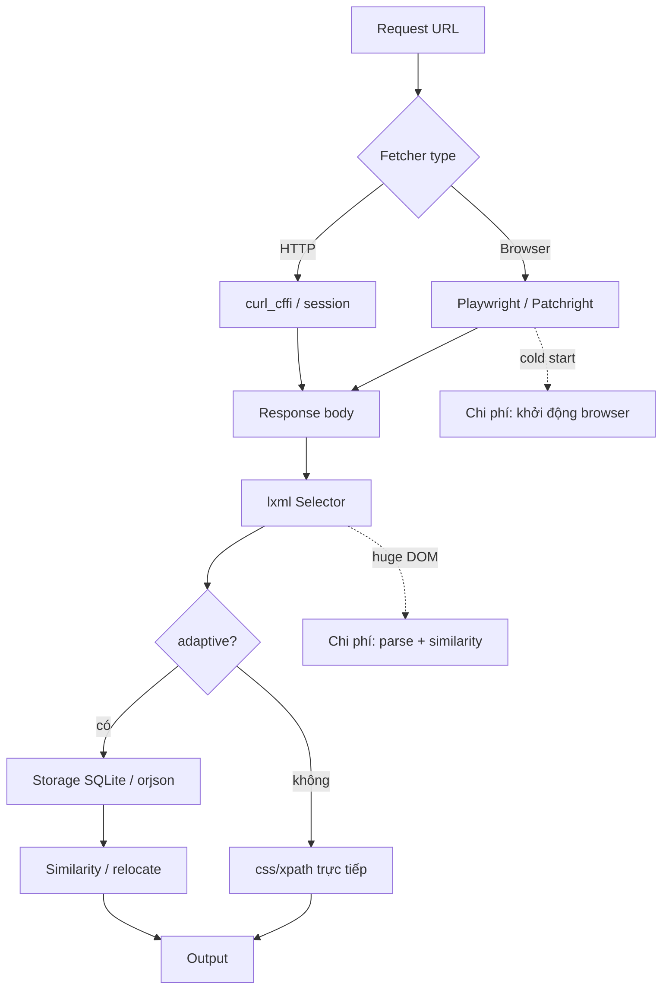

# Code review tổng hợp — Scrapling (Python)

Tài liệu này tóm tắt một đợt rà soát tĩnh trên package `scrapling/` và các điểm liên quan (CLI, checkpoint). Phạm vi: **chất lượng mã**, **bảo mật**, **hiệu năng**, **thực hành tốt với Python**. Ngôn ngữ triển khai: **Python ≥ 3.10**.

---

## Phạm vi và phương pháp

- Đọc mã nguồn trọng tâm: `core/storage.py`, `spiders/checkpoint.py`, `core/shell.py`, `core/ai.py`, `engines/`, `parser.py`, `cli.py`.
- Tra cứu pattern nguy hiểm (SQL động, `pickle`, `subprocess`, lộ bí mật).
- Ước lượng độ phức tạp hàm bằng AST (số nút càng lớn thường càng khó bảo trì).
- **Bandit** đã chạy cục bộ (`python -m bandit`); chi tiết ở **mục 7**.

---

## 1. Code quality

### 1.1 Trùng lặp (DRY)

| Khu vực | Quan sát |
|---------|----------|
| **`engines/static.py`** | Khối mô tả tham số `proxy` / `proxy_auth` / `auth` lặp lại nhiều lần trong docstring của các nhóm API tương tự (ví dụ quanh các factory/fetch). Dễ lệch phiên bản khi sửa một chỗ. **Gợi ý:** trích một đoạn Sphinx/reStructuredText dùng chung, hoặc bảng tham số một lần + link “Xem mục Proxy”. |
| **`scrapling/fetchers/*.py` và `stealth_chrome.py` / `chrome.py`** | Docstring dài, cấu trúc gần giống giữa `fetch()` của từng loại fetcher. **Gợi ý:** mixin docstring hoặc generate từ schema (msgspec/pydantic) nếu muốn giảm trùng. |
| **`core/ai.py` (MCP)** | Nhiều tool có cùng bộ tham số (`css_selector`, `main_content_only`, `proxy`, …) và đoạn mô tả lặp. **Gợi ý:** factory đăng ký tool + dict tham số chung. |

### 1.2 Hàm / lớp quá lớn (khó đọc, khó test)

Kết quả gợi ý từ AST (càng lớn càng nên tách nhỏ hoặc tách nhánh):

| File | Hàm / phương thức | Ghi chú |
|------|-------------------|---------|
| `core/shell.py` | `CurlParser.parse` | Rất lớn (~hàng trăm nút AST): xử lý curl, method, data, headers, proxy… **Gợi ý:** tách từng giai đoạn (tokenize → map argparse → build `Request`). |
| `parser.py` | `find_all`, `Selector.__init__`, `__calculate_similarity_score` | Logic adaptive + XPath/CSS + tìm kiếm tương đồng gộp chung. **Gợi ý:** tách bộ điểm similarity và nhánh CSS/XPath. |
| `engines/_browsers/_controllers.py` | `fetch` | Điều khiển Playwright đồng bộ, nhiều nhánh. |
| `engines/_browsers/_stealth.py` | `fetch`, `_cloudflare_solver` | Tương tự; stealth + solver dễ tách module riêng. |
| `spiders/request.py` | `update_fingerprint` | Nhiều trường hợp fingerprint; có thể tách theo loại tham số. |

### 1.3 Mùi khác

- **`SQLiteStorageSystem.__del__` gọi `close()`** (`storage.py`): hành vi destructor với I/O có thể gây khó đoán (thứ tự hủy, exception khi shutdown). **Gợi ý:** ưu tiên context manager `with` / `close()` tường minh trong docs.
- **`cli.py`** tập trung nhiều lệnh `extract` tương tự (khác fetcher): có thể gom tham số chung + dispatch table để giảm copy-paste.

---

## 2. Security

### 2.1 SQL injection

- **`SQLiteStorageSystem`** dùng truy vấn tham số hóa (`?`) cho `INSERT`/`SELECT`, không nối chuỗi SQL từ input người dùng.

```119:141:scrapling/core/storage.py
            self.cursor.execute(
                """
                INSERT OR REPLACE INTO storage (url, identifier, element_data)
                VALUES (?, ?, ?)
            """,
                (url, identifier, dumps(element_data)),
            )
...
            self.cursor.execute(
                "SELECT element_data FROM storage WHERE url = ? AND identifier = ?",
                (url, identifier),
            )
```

**Kết luận:** Rủi ro SQL injection **thấp** với đường dùng hiện tại.

### 2.2 Deserialize không an toàn (`pickle`)

- **`CheckpointManager.load`** dùng `pickle.loads` trên nội dung file `checkpoint.pkl`.

```71:74:scrapling/spiders/checkpoint.py
            async with await anyio.open_file(self._checkpoint_path, "rb") as f:
                content = await f.read()
                data: CheckpointData = pickle.loads(content)
```

- Nếu kẻ tấn công **ghi đè** file pickle trong `crawldir` (quyền filesystem yếu hoặc đường dẫn dùng chung), có thể kích hoạt thực thi mã khi deserialize (đặc tính của pickle).
- Repo có **Bandit B301** trong `.bandit.yml` (`skips`) — tức là rủi ro đã **có nhận thức** nhưng vẫn cần **mô hình đe dọa** rõ: chỉ load checkpoint từ thư mục tin cậy, quyền OS phù hợp.

**Gợi ý:** ghi rõ trong tài liệu bảo mật; cân nhắc định dạng thay thế (JSON/msgpack) cho phần có thể tuần tự hóa an toàn hơn (có thể phức tạp vì `Request`).

### 2.3 SSRF và URL tùy ý

- HTTP layer có **`follow_redirects="safe"`** và docstring đề cập từ chối redirect tới IP nội bộ — ví dụ trong `FetcherSession` / shell curl parser. Đây là hướng **đúng** để giảm SSRF qua redirect.
- **MCP / fetcher** vẫn cho phép người gọi (hoặc LLM) chỉ định URL bất kỳ: rủi ro chủ yếu là **vận hành** (máy chạy MCP có thể truy cập metadata nội bộ nếu URL do agent chọn). Không phải lỗi phân quyền trong thư viện, mà là **policy** triển khai (network segmentation, allowlist, v.v.).

### 2.4 Tiêm prompt / nội dung ẩn (MCP → LLM)

- `core/shell.py` có XPath và regex gỡ nội dung ẩn / zero-width phục vụ **giảm prompt injection** khi đưa HTML sang AI (cùng hướng với mô tả trong docs MCP). Cần **duy trì** khi thêm đường extract mới.

### 2.5 Subprocess

- `cli.py` dùng `subprocess.check_output(..., shell=False)` — **an toàn hơn** so với `shell=True` (đã ghi chú `nosec`).

### 2.6 Lộ thông tin nhạy cảm

- Không thấy hardcode API key trong mã nguồn package; proxy credentials đến từ **tham số người dùng** (đúng kỳ vọng scraper).

### 2.7 Phân quyền (authorization)

- Thư viện **không** phải dịch vụ đa người dùng: không có RBAC trong repo. Rủi ro “phân quyền” chủ yếu ở **triển khai MCP** (ai được phép chạy server).

---

## 3. Performance

| Chủ đề | Nhận xét |
|--------|----------|
| **JSON** | `orjson` cho lưu/đọc payload SQLite — tốt. |
| **SQLite** | `PRAGMA journal_mode=WAL` + `RLock` — phù hợp đọc/ghi concurrent vừa phải. |
| **HTML** | `lxml` — nhanh cho DOM lớn so với thuần Python. |
| **Adaptive / similarity** | `__calculate_similarity_score` và tìm phần tử tương tự có thể **O(n·m)** trên cây lớn — trang HTML khổng lồ có thể chậm; cần benchmark thực tế. |
| **Trình duyệt** | Khởi động browser / stealth là **điểm nặng** tự nhiên; session tái sử dụng (đã có trong MCP) giúp giảm. |
| **Checkpoint** | Ghi pickle định kỳ — ổ đĩa chậm hoặc crawl lớn có thể cần tuning `interval`. |

---

## 4. Best practices (Python)

| Mặt | Trạng thái |
|-----|------------|
| **Typing** | Nhiều file dùng `typing`, `TYPE_CHECKING`, gợi ý kiểu cho API công khai. |
| **Packaging** | `pyproject.toml` chuẩn, optional extras (`fetchers`, `ai`, `shell`). |
| **Lint / type** | `ruff.toml`, `mypy`/`pyright` trong `pyproject.toml` — tốt nếu CI bắt buộc. |
| **Bandit** | `.bandit.yml` loại trừ nhiều test — xem **mục 7** (kết quả chạy thực tế); vẫn nên **ghi lý do** khi mở rộng skip. |
| **PEP 8 / style** | Nhìn chung nhất quán; tên như `__ParseJSONData` (PascalCase cho hàm private) hơi lệch PEP 8 nhưng có vẻ là quy ước nội bộ — không sai chức năng. |

---

## 5. Sơ đồ Mermaid

### 5.1. Các chiều rà soát (tổng quan)



### 5.2. Mô hình đe dọa đơn giản (bảo mật)



### 5.3. Luồng dữ liệu liên quan hiệu năng (fetch → parse)



---

## 6. Kết luận ngắn

- **Chất lượng:** Nên giảm trùng docstring và tách các hàm “khủng” (`CurlParser.parse`, `find_all`, các `fetch` stealth/dynamic).
- **Bảo mật:** SQL ổn; **pickle checkpoint** là điểm cần **tin cậy filesystem** và tài liệu hóa; MCP cần **nguyên tắc triển khai** (mạng, URL).
- **Hiệu năng:** Stack JSON/HTML/SQLite hợp lý; tập trung đo **adaptive** và **browser** khi tối ưu.
- **Python:** Cấu trúc package và typing tốt; duy trì CI và ghi chú cho các **bandit skip** có chủ đích.

---

## 7. Phụ lục: Kết quả Bandit (chạy thực tế)

**Môi trường:** Windows, `python -m bandit` (Bandit 1.9.x), thư mục làm việc gốc repo.

### 7.1. Quét mặc định (không dùng `.bandit.yml`)

```text
python -m bandit -r scrapling -f txt
```

- **Dòng mã quét:** 8439  
- **Mức độ:** 15 Low, **2 Medium**, 0 High  
- **Ghi chú:** 1 dòng được bỏ qua nhờ `#nosec` (không nằm trong danh sách “potential issues skipped” đầy đủ trên stdout; metrics báo `skipped due to #nosec: 1`).

| Mã | Mức | File (tiêu biểu) | Ý nghĩa ngắn |
|----|-----|------------------|--------------|
| B404 | Low | `cli.py` | Import `subprocess` (cảnh báo chung; dùng `check_output`, `shell=False`). |
| B104 | Medium | `cli.py` (~151) | Default host MCP `0.0.0.0` — lộ dịch vụ ra mọi interface nếu bật transport HTTP. |
| B101 | Low | `_base.py`, `_stealth.py`, `static.py`, `parser.py` | Dùng `assert` (bị tối ưu hóa bỏ khi `python -O`). |
| B311 | Low | `_stealth.py`, `static.py` | `random`/`choice` — không dùng cho mật mã (ở đây là hành vi ngẫu nhiên hóa UI, chấp nhận được). |
| B403 | Low | `checkpoint.py` | Import `pickle`. |
| B301 | Medium | `checkpoint.py` (~74) | `pickle.loads` trên dữ liệu từ đĩa — rủi ro nếu file không tin cậy. |

### 7.2. Quét với cấu hình dự án (`.bandit.yml`)

```text
python -m bandit -r scrapling -c .bandit.yml -f txt
```

- **Kết quả:** `No issues identified.` (exit code 0)  
- **Các test bị loại trừ trong config:** `B403`, `B104`, `B110`, `B301`, `B311`, `B108`, `B101`, `B404`, `B113`, `B602` — trùng với `.bandit.yml` trong repo (đội có **chấp nhận rủi ro / false positive** có chủ đích).

### 7.3. Gợi ý vận hành

- Chạy **`python -m bandit -r scrapling`** (không config) định kỳ để thấy cảnh báo “thô” trước khi merge.  
- Giữ **`.bandit.yml`** đồng bộ với lý do nghiệp vụ (đặc biệt B301/B104 khi thay đổi MCP/network).

---

*Tài liệu đã bổ sung Bandit; nên tiếp tục pytest và profiling theo nhu cầu release.*
