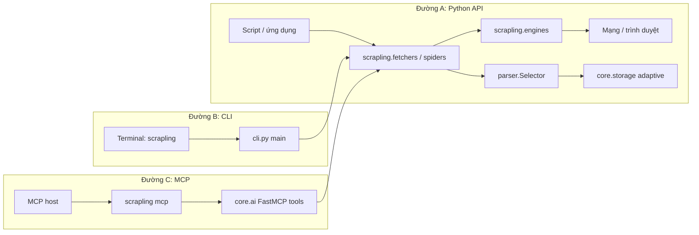
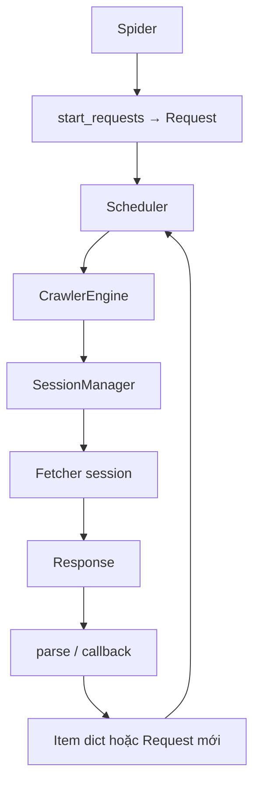

# Hướng dẫn thành viên mới — Scrapling

Tài liệu ngắn gọn cho người mới tham gia dự án: **chức năng**, **cấu trúc thư mục**, **luồng dữ liệu**, **stack kỹ thuật**, và **sơ đồ Mermaid**.

---

## 1. Chức năng chính của repository

**Scrapling** là một **thư viện Python** (package `scrapling`) phục vụ **web scraping / crawling** trên web hiện đại:

| Khối | Việc làm |
|------|----------|
| **Fetch** | Lấy HTML/phản hồi qua HTTP (TLS impersonation), trình duyệt động (Playwright), hoặc chế độ stealth (Patchright) để giảm bị chặn. |
| **Parse** | Truy vấn DOM bằng CSS/XPath (`Selector`), có chế độ **adaptive** (nhớ cấu trúc phần tử để bám theo khi trang đổi layout). |
| **Spider** | Framework crawl bất đồng bộ (kiểu Scrapy): hàng đợi request, giới hạn đồng thời, robots.txt, checkpoint pause/resume, cache khi dev. |
| **Công cụ** | **CLI** (`scrapling` trong terminal) và **MCP server** (tùy cài `scrapling[ai]`) để agent/LLM gọi scraping qua giao thức MCP. |

Đây **không phải** ứng dụng web với REST API cố định; luồng chính là **code Python** hoặc **process** (CLI/MCP) gọi vào package.

---

## 2. Cấu trúc thư mục quan trọng

```
Scrapling/
├── scrapling/              # Mã nguồn package chính
│   ├── fetchers/           # Fetcher, session (HTTP / dynamic / stealth)
│   ├── engines/            # Tầng engine: static, browser, toolbelt (response, proxy, navigation…)
│   ├── spiders/            # Spider, CrawlerEngine, Scheduler, Request/Response, checkpoint, cache
│   ├── core/               # Storage adaptive, shell REPL, utils, AI/MCP wiring
│   ├── parser.py           # Selector / parsing chính
│   └── cli.py              # Lệnh `scrapling` (Click)
├── tests/                  # Pytest theo từng module
├── docs/                   # Tài liệu MkDocs / Read the Docs
├── agent-skill/            # Skill & ví dụ cho AI agent (Scrapling-Skill)
├── .github/workflows/      # CI: test, code quality, Docker
├── pyproject.toml          # Metadata package, dependencies, entry point CLI
├── Dockerfile              # Image chứa môi trường đầy đủ (kể cả browser)
├── OVERVIEW.md             # Phân tích kiến trúc / PM / dev (nếu có trong repo)
└── ONBOARDING.md           # File này
```

**Ý nghĩa ngắn gọn:**

| Thư mục / file | Vai trò |
|----------------|---------|
| `scrapling/fetchers/` | API “lấy trang” mà developer import; lazy-import để giảm phụ thuộc. |
| `scrapling/engines/` | Triển khai thấp: HTTP impersonate, điều khiển Chrome, stealth, chuyển đổi nội dung. |
| `scrapling/spiders/` | Toàn bộ vòng đời crawl: engine ↔ scheduler ↔ sessions. |
| `scrapling/core/` | Lưu adaptive (`storage.py`), shell tương tác, `ai.py` (FastMCP + tool). |
| `tests/` | Regression theo domain; chỉnh code nên chạy pytest liên quan. |
| `docs/` | Nguồn sự thật cho hành vi công khai; đổi API cần cập nhật docs. |

---

## 3. Luồng dữ liệu chính (từ đâu đến đâu?)

Scrapling **không** có “API endpoint HTTP” mặc định như một backend web. Ba đường vào chính:

### A. Thư viện Python (phổ biến nhất)

Người dùng gọi `Fetcher.fetch(...)` / `StealthyFetcher` / `Spider().start()` trong script → **fetchers** → **engines** (HTTP hoặc browser) → nhận body → **`parser.Selector`** (và optional **adaptive storage** trong `core/storage.py`).

### B. CLI

Shell chạy `scrapling …` → entry `scrapling.cli:main` (`pyproject.toml` `[project.scripts]`) → cùng stack fetcher/parser như trên, kèm ghi file / shell tùy lệnh.

### C. MCP (Model Context Protocol)

Host (Claude Desktop, IDE, v.v.) spawn process ví dụ `scrapling mcp` → **Click** trong `cli.py` → **`scrapling.core.ai`** dùng **FastMCP** đăng ký tool (`get`, `fetch`, `stealthy_fetch`, session…) → bên trong vẫn gọi **fetchers** + **Convertor** (shell) để trả nội dung đã trích. Giao tiếp là **MCP** (stdio/SSE tùy cấu hình), **không** phải REST URL cố định của Scrapling.



### Luồng Spider (crawl)

`Spider.start_requests()` → **Scheduler** (hàng đợi + fingerprint) → **CrawlerEngine** lấy request → **SessionManager** chọn session theo `sid` → fetch → **callback `parse`** → `yield` item hoặc `Request` mới → lặp đến khi hết hàng đợi (xem chi tiết `docs/spiders/architecture.md`).



---

## 4. Công nghệ, framework và thư viện cốt lõi

| Loại | Thành phần |
|------|------------|
| **Ngôn ngữ** | Python **≥ 3.10** |
| **Build** | setuptools, khai báo trong `pyproject.toml` |
| **Parser HTML** | **lxml**, **cssselect** |
| **JSON nhanh** | **orjson** |
| **Tiện ích** | **tld**, **w3lib**, **typing_extensions** |
| **Fetcher (optional `scrapling[fetchers]`)** | **click**, **curl_cffi**, **playwright**, **patchright**, **browserforge**, **apify-fingerprint-datapoints**, **msgspec**, **anyio**, **protego** (robots) |
| **MCP / AI extra (`scrapling[ai]`)** | **mcp** (FastMCP), **markdownify** |
| **Shell extra** | **IPython**, **markdownify** |
| **Test / chất lượng** | pytest (trong `tests/`), ruff, mypy/pyright (cấu hình trong repo) |

Cài đặt tối thiểu chỉ parser: `pip install scrapling`. Full fetch + CLI: `pip install "scrapling[fetchers]"` hoặc `[all]`.

---

## 5. Gợi ý bước tiếp theo

1. Đọc `README.md` và `docs/fetching/choosing.md`.
2. Chạy test cục bộ: `pytest` (sau khi cài dependencies dev / extras theo `CONTRIBUTING.md` nếu có).
3. Nếu làm MCP: `docs/ai/mcp-server.md` và `scrapling/core/ai.py`.

*Tài liệu này bổ sung cho `OVERVIEW.md` (phân tích sâu hơn về kiến trúc).*
