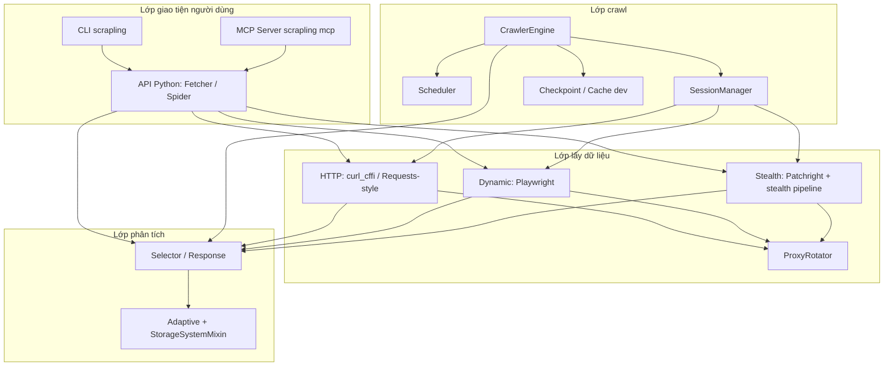
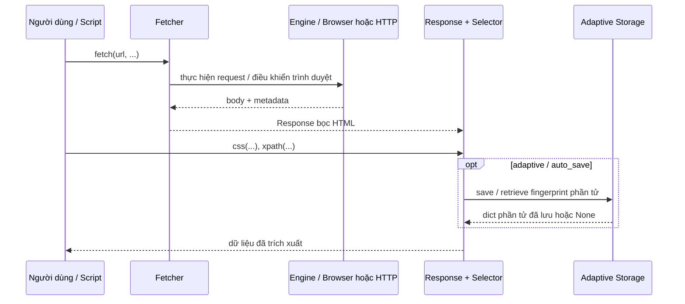
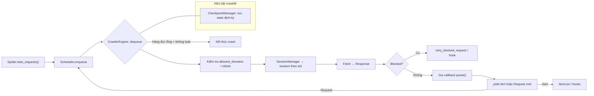
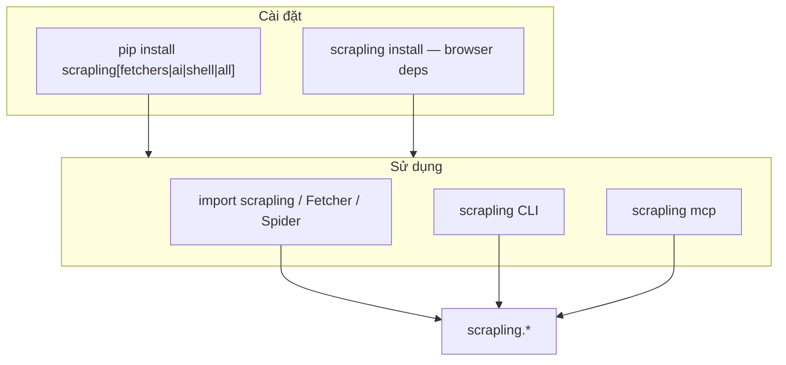

# Scrapling — Tổng quan repository

Tài liệu này tổng hợp phân tích **Scrapling** theo ba góc độ: kiến trúc phần mềm, lập trình viên và quản lý sản phẩm, kèm sơ đồ **Mermaid** mô tả luồng hoạt động chính.

---

## Tóm tắt nhanh

**Scrapling** là thư viện Python (BSD) cho **web scraping** hiện đại: từ một request đơn lẻ đến crawl quy mô lớn. Điểm nổi bật:

- **Fetcher** đa tầng: HTTP (curl_cffi / impersonate), trình duyệt động (Playwright), chế độ **stealth** (Patchright) để vượt nhiều lớp chống bot.
- **Parser** dựa trên `lxml` + CSS/XPath; tính năng **adaptive** lưu “dấu vết” phần tử để tự điều chỉnh khi HTML thay đổi (có thể tùy biến backend lưu trữ, mặc định SQLite).
- **Spider** bất đồng bộ, phong cách Scrapy: scheduler, session manager, checkpoint (pause/resume), cache phát triển, proxy rotation.
- **CLI** (`scrapling`) và **MCP server** (extra `ai`) để tích hợp agent/LLM.

Phiên bản tham chiếu trong repo: **0.4.5** · Python **≥ 3.10**.

---

## 1. Góc độ kiến trúc sư phần mềm

### Thiết kế tổng thể

Hệ thống được chia thành các **lớp có ranh giới rõ**:

| Lớp | Vai trò |
|-----|---------|
| **Engines** | Trừu tượng hóa trình duyệt/tài nguyên tĩnh (`static`), điều khiển Chrome/stealth, chuyển đổi response, fingerprint, navigation. |
| **Fetchers** | API người dùng cho “lấy trang”: sync/async HTTP, dynamic, stealthy; gắn với `ProxyRotator` và session. |
| **Parser** | `Selector` / `Selectors`: truy vấn DOM, adaptive storage, tương thích kiểu Beautiful Soup ở mức sử dụng. |
| **Spiders** | Framework crawl: `CrawlerEngine`, `Scheduler`, `SessionManager`, `Request`/`Response`, checkpoint, robots.txt, cache. |
| **Core** | Kiểu dữ liệu, shell REPL, storage mixin, translator CSS→XPath, utilities, tích hợp AI/MCP. |

### Pattern kiến trúc

- **Layered architecture**: Fetcher → Engine/Toolbelt → (HTTP hoặc browser); Parser độc lập với nguồn HTML nhận được.
- **Strategy / pluggable storage**: `StorageSystemMixin` + `save`/`retrieve` cho adaptive; mặc định SQLite, có thể thay Redis, v.v. (Singleton qua `lru_cache` theo tài liệu).
- **Scrapy-inspired spider**: Tách **scheduler** (hàng đợi ưu tiên + fingerprint), **engine** (vòng lặp crawl + giới hạn đồng thời), **session manager** (định tuyến theo `sid`).
- **Lazy imports**: Giảm thời gian import và phụ thuộc tùy chọn (`scrapling`, `scrapling.fetchers`).
- **Optional extras** (`pyproject.toml`): `fetchers`, `ai`, `shell`, `all` — cài đặt theo nhu cầu, tránh nặng môi trường tối thiểu.

### Khả năng mở rộng

- Thêm fetcher/session type mới trong `fetchers/` và đăng ký qua `SessionManager`.
- Custom `is_blocked` / retry cho spider; hooks item qua `on_scraped_item`.
- Mở rộng lưu adaptive: implement `StorageSystemMixin`.
- MCP: thêm công cụ mới trong lớp AI nếu roadmap cho phép.

---

## 2. Góc độ lập trình viên

### Cấu trúc thư mục quan trọng

| Đường dẫn | Ý nghĩa |
|-----------|---------|
| `scrapling/` | Package chính: `fetchers`, `engines`, `spiders`, `core`, `parser.py`, `cli.py`. |
| `tests/` | Pytest theo domain: fetchers, spiders, parser, cli, core, ai. |
| `docs/` | Read the Docs: hướng dẫn fetching, parsing, spiders, CLI, MCP, API reference. |
| `agent-skill/` | Skill / ví dụ cho agent (Scrapling-Skill). |
| `.github/workflows/` | CI: tests, code quality, Docker. |

### Thư viện cốt lõi (`pyproject.toml`)

- **Bắt buộc**: `lxml`, `cssselect`, `orjson`, `tld`, `w3lib`, `typing_extensions`.
- **Optional `fetchers`**: `click`, `curl_cffi`, `playwright`, `patchright`, `browserforge`, `apify-fingerprint-datapoints`, `msgspec`, `anyio`, `protego`, …
- **Optional `ai`**: `mcp`, `markdownify`, và kéo theo `scrapling[fetchers]`.
- **Optional `shell`**: `IPython`, `markdownify`, `scrapling[fetchers]`.

### Chi tiết triển khai đáng chú ý

- **`scrapling/parser.py`**: `Selector` kế thừa mixins, tích hợp `SQLiteStorageSystem` / `StorageSystemMixin`, dịch CSS sang XPath.
- **`scrapling/spiders/engine.py`**: `CrawlerEngine` điều phối async, `CapacityLimiter`, robots, development cache, checkpoint.
- **`scrapling/cli.py`**: Click-based; yêu cầu extra fetchers cho lệnh shell/extract; entry `scrapling = scrapling.cli:main`.
- **Chất lượng**: `ruff`, `mypy`/`pyright` cấu hình trong `pyproject.toml`; type hints rộng rãi trong package `scrapling`.

### Khả năng bảo trì

- Module hóa tốt; tài liệu `docs/spiders/architecture.md` đồng bộ với luồng engine.
- Phụ thuộc tùy chọn giúp giảm “địa ngục phụ thuộc” cho người chỉ cần parser.
- Test suite theo từng thành phần hỗ trợ refactor có kiểm soát.

---

## 3. Góc độ quản lý sản phẩm

### Mục đích sản phẩm

Cung cấp **một stack thống nhất** cho team và cá nhân cần:

1. Thu thập dữ liệu web **ổn định** trước thay đổi giao diện (adaptive).
2. **Vượt** các cơ chế chống bot phổ biến (TLS impersonation, trình duyệt thật/giả lập, stealth).
3. **Scale** crawl với kiểm soát tải, nối lại sau gián đoạn, xoay proxy.

### Tính năng chính (value proposition)

| Nhóm | Tính năng |
|------|-----------|
| Fetching | HTTP nhanh, trang JS, stealth Cloudflare-class; proxy rotation. |
| Parsing | CSS/XPath, API quen thuộc, adaptive + lưu trữ có thể thay thế. |
| Crawling | Spider async, streaming items, stats, robots, checkpoint. |
| Tooling | CLI extract/shell, MCP cho workflow AI (selector trước khi đưa vào prompt). |

### Luồng người dùng (user flows)

1. **Nhà phát triển tích hợp thư viện**: Cài `scrapling[fetchers]` → gọi `StealthyFetcher.fetch` / `css()` với `adaptive=True`.
2. **Crawl dự án**: subclass `Spider` → `start_urls` + `parse` → `start()` hoặc `stream()`.
3. **Vận hành qua CLI**: `scrapling extract …` / lệnh cài browser `scrapling install`.
4. **Agent / LLM**: cấu hình MCP `scrapling mcp`, dùng tool `get` / `fetch` / `stealthy_fetch` với selector để giảm token.

---

## 4. Luồng dữ liệu — sơ đồ Mermaid

### 4.1. Luồng đơn giản: Fetch một URL rồi parse

### 4.2. Luồng Spider (crawl)

### 4.3. Bản đồ entry point (CLI / MCP / thư viện)

---

## 5. Kết luận

Scrapling kết hợp **lấy dữ liệu chịu tải thực tế** (HTTP + trình duyệt + stealth), **parsing thích ứng** và **framework crawl** có trạng thái, trong một package có **tách optional dependencies** và **nhiều đường vào** (API, CLI, MCP). Kiến trúc phù hợp mở rộng theo chiều fetcher mới, storage adaptive tùy chỉnh và hook trên spider; phía sản phẩm, giá trị chính là giảm ma sát từ prototype tới crawl production và tích hợp AI an toàn hơn (selector trước, MCP).

---

*Tài liệu được tạo dựa trên cấu trúc repository và `pyproject.toml`, `README.md`, `docs/spiders/architecture.md`, và mã nguồn package `scrapling/`.*
